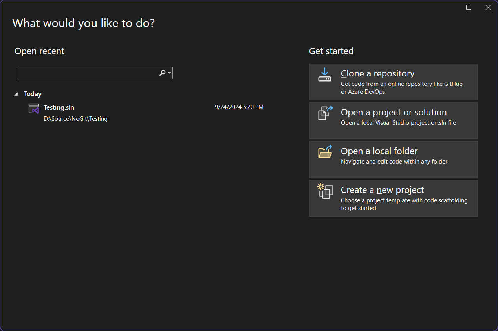

# Upgrade

There are two ways to upgrade our library in your project:

* Using Visual Studio's NuGet package manager
* Manual upgrade

## Visual Studio's NuGet package manager

If you're using Visual Studio to build your project, it provides you an easy way to install NuGet packages, such as our libraries, into your project. This is easy and straightforward. In order to upgrade a NuGet library to your project, follow the steps:

1.  Open Visual Studio to a project that you want to upgrade our libraries.\


    <figure><figcaption></figcaption></figure>
2.  Right click on either the project or the `Dependencies` entry beneath the project in the Solution Explorer pane and select `Manage NuGet packages...`\


    <figure><figcaption></figcaption></figure>
3.  Click on `Updates`. Then, select the desired library you'd like to upgrade, such as Terminaux.\


    <figure><figcaption></figcaption></figure>
4.  Click on any of the libraries that show up in the search results, and click on `Update`.\


    <figure><figcaption></figcaption></figure>
5.  If any package asks for your acceptance of the license, read the license contained by clicking on their license names, then click on `I Accept`.\


    <figure><figcaption></figcaption></figure>
6.  The package is upgraded! Verify by expanding the `Dependencies` entry beneath the project and expanding the `Packages` entry.\


    <figure><figcaption></figcaption></figure>

## Manual upgrade

If you'd like to manually upgrade a NuGet package to a project with your favorite editor or if you're unable to use Visual Studio for some reason, you can use this upgrade method. However, this method comes in two ways:

* Visual Studio
* Text editor

### Visual Studio

If you are using Visual Studio, follow these steps:

1.  Open Visual Studio to a project that you want to upgrade our libraries.\


    <figure><figcaption></figcaption></figure>
2.  Double click on the project as shown in the Solution Explorer pane\


    <figure><figcaption></figcaption></figure>
3.  Look for the `PackageReference` property that targets a specific library (for example, Terminaux) and change the `Version` attribute (replace `5.3.0.1` with the desired version of the library)


    ```xml
    <ItemGroup>
      <PackageReference Include="Terminaux" Version="5.3.0.1" />
    </ItemGroup>
    ```


4.  Save the project file. It should automatically upgrade the required packages. If, however, the package restoration didn't automatically start, right-click on the solution and select `Restore NuGet Packages`.\


    <figure><figcaption></figcaption></figure>

### Text editor

If you are using your favorite text editor, such as Visual Studio Code or Sublime Text, follow these steps:

1.  Open the file explorer and navigate to the target project directory that contains the project file (not the solution `.sln` file)\


    <figure><figcaption></figcaption></figure>
2.  Right-click on the project file -> `Open With` -> your favorite text editor\


    <figure><figcaption></figcaption></figure>
3.  Look for the `PackageReference` property that targets a specific library (for example, Terminaux) and change the `Version` attribute (replace `5.3.0.1` with the desired version of the library)


    ```xml
    <ItemGroup>
      <PackageReference Include="Terminaux" Version="5.3.0.1" />
    </ItemGroup>
    ```


4.  Save the project file. Then, open the terminal emulator in your preferred way and execute `dotnet restore`.\


    <figure><figcaption></figcaption></figure>


This also applies to terminal-based text editors, such as `vim`, though you'll have to open the terminal emulator beforehand in order to be able to use them.

